# Night Club: Project Documentation

**Assignment:** Svendeprøve, Night Club
**Name:** Sebastian Køster
**Class:** Web-Udvikler WU14
**School:** Roskilde Tekniske Skole
**Repository:** https://github.com/rts-cmk/terminspr-ve-a-wu14-kosterseb
**Project board:** https://github.com/orgs/rts-cmk/projects/8/views/1

Optional task 1: **video player**. Optional task 2: **blog**.

---

## 1. Running the project

There is no live version. The assignment says the API runs locally, so a hosted
frontend could not reach it. Both parts start with one command from the root:

```bash
npm install                        # first time only
npm install --prefix nightclub
npm install --prefix api
npm run dev
```

| | |
| --- | --- |
| Site | http://localhost:3000 |
| API | http://localhost:4000 |

**Test user:** `user@nightclub.dk` / `nightclub123!`

The user was created through `POST /register` because the API stores passwords
bcrypt-hashed, it cannot be written into `db.json` by hand.
`api/db_backup.json` resets the data, but then the test user must be registered
again.

---

## 2. Tech stack

| | |
| --- | --- |
| Framework | Next.js 16.3.0 (App Router, React 19.2.8) |
| Language | TypeScript 5.9 |
| Styling | Tailwind CSS 4.3 |
| Validation | Zod 4.4 |
| Quality | ESLint 9, Prettier 3.9 |
| API | json-server 0.17 + json-server-auth + json-server-relationship |

No bundler is configured by hand. Next.js runs Turbopack itself.

---

## 3. Third-party code

| What | Where from |
| --- | --- |
| The API in `api/` | Supplied by the school, `rts-cmk/night-club-api` (Brian Emilius). Unchanged apart from seed data |
| Design | Supplied Figma file, `NightClub.fig` |
| Images, video, audio | Supplied in `assets/`, moved to `nightclub/public/` |
| Next.js, React, Tailwind, Zod | npm, versions above |
| Ubuntu | Google Fonts through `next/font` |

Nav and footer icons are hand-written inline SVG in `app/ui/icons.tsx`. The
design uses Iconduck icons, but those were not shipped as files.

Everything under `nightclub/app/` was written for this assignment.

---

## 4. What was built

### Mandatory

| Requirement | Where |
| --- | --- |
| Main navigation | `app/ui/nav.tsx`: sticky, active item pink with a line under it, mobile overlay |
| Footer | `app/ui/footer.tsx` |
| Hero | `app/ui/home/hero.tsx`: full screen, random background per page load |
| Section 1 | `app/ui/home/welcome.tsx` |
| Section 2 | `app/ui/home/events.tsx`: carousel, 2 events per slide, data from API |
| Section 3 | `app/ui/home/gallery.tsx`: full width, lightbox, fly-in on scroll |
| Section 6 | `app/ui/home/testimonials.tsx`: carousel, data from API |
| Section 8 | `app/ui/home/newsletter.tsx`: saved to the API |
| Contact Us | `app/(site)/contact/page.tsx`: saved to the API |
| Log in / Register | `app/(site)/login`, `app/(site)/register` |


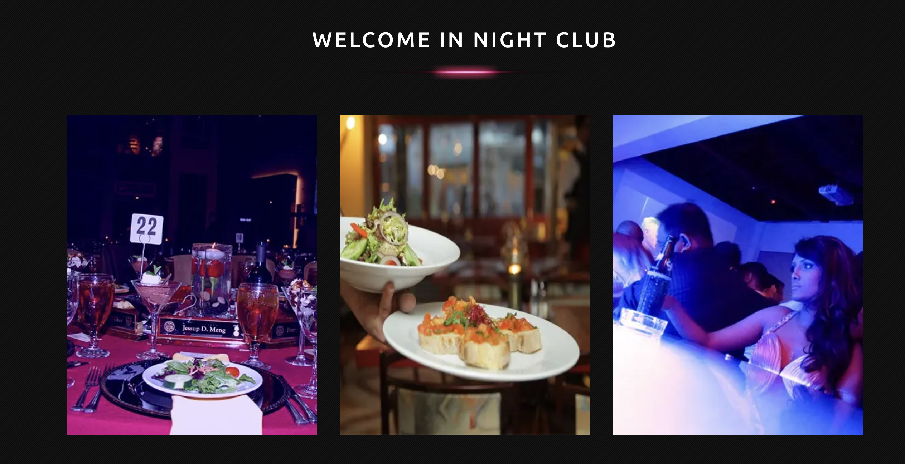
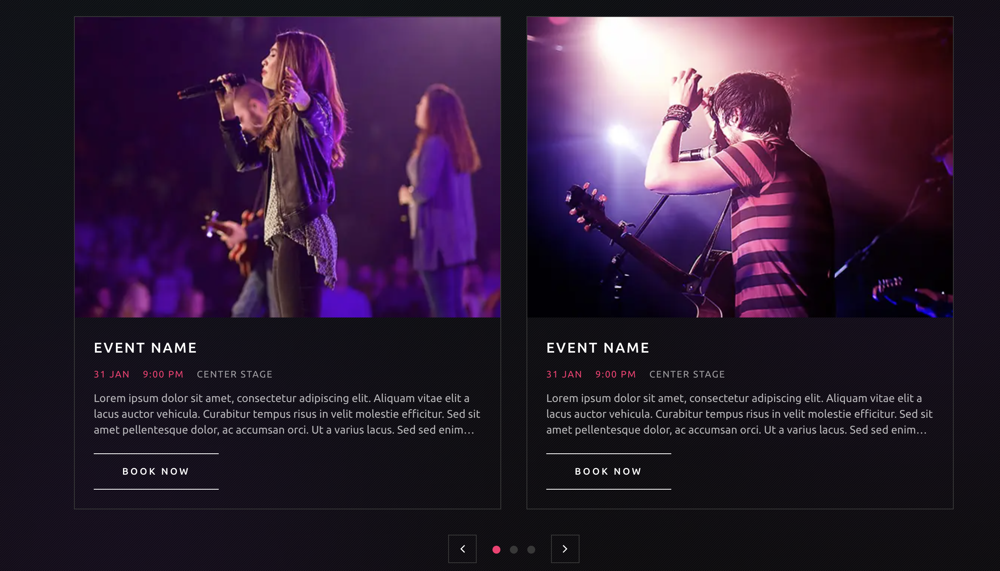
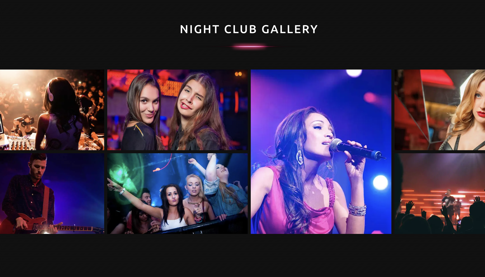
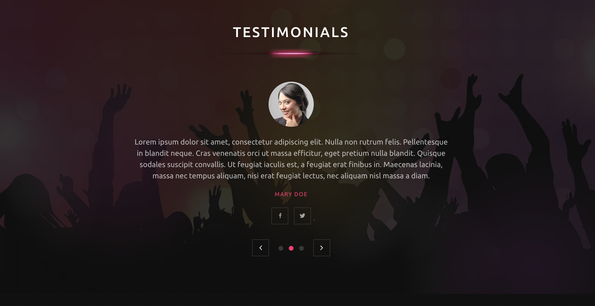
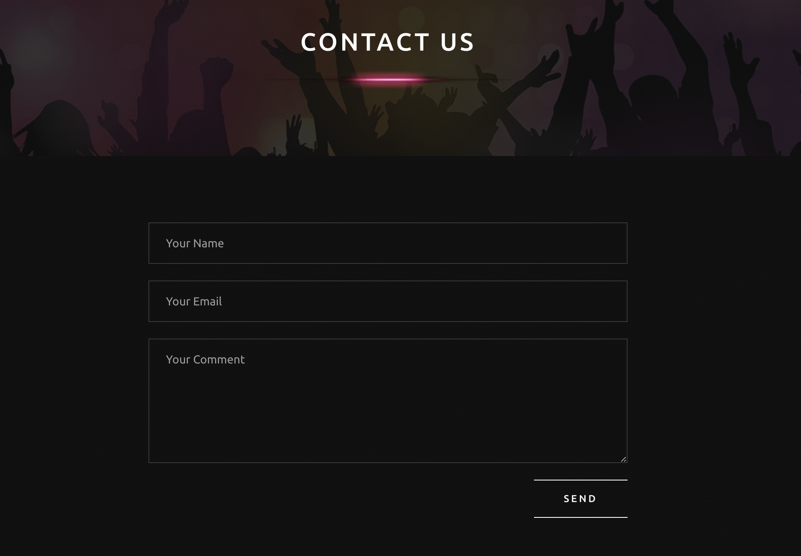

### Optional 1: video player (section 5)

`app/ui/home/video.tsx` and `video-player.tsx`. The two newest clips come from
`public/media/`, not from the API. A native `<video controls>` gives play/pause,
volume, scrubbing and duration. If playback fails, `no_video.png` is shown
instead.

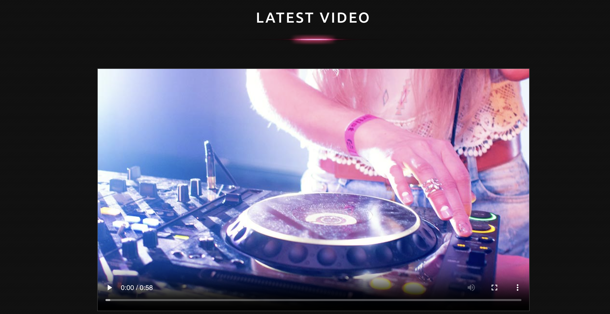

### Optional 2: blog

| Requirement | Where |
| --- | --- |
| Section 7 | `app/ui/home/recent-blog.tsx`: 3 newest, excerpt clamped to 3 lines |
| All posts | `app/(site)/blog/page.tsx`: 3 per page, newest first, image alternating left/right |
| Single post | `app/(site)/blog/[id]/page.tsx` |
| Comments and replies | `app/ui/blog/comment-list.tsx`, `comment-form.tsx` |
| My Comments | `app/(site)/my-comments/page.tsx`: members only, with delete |

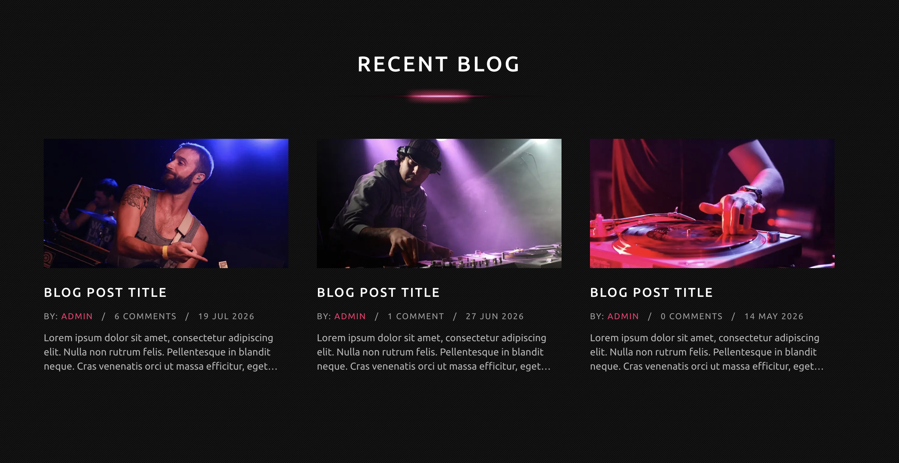
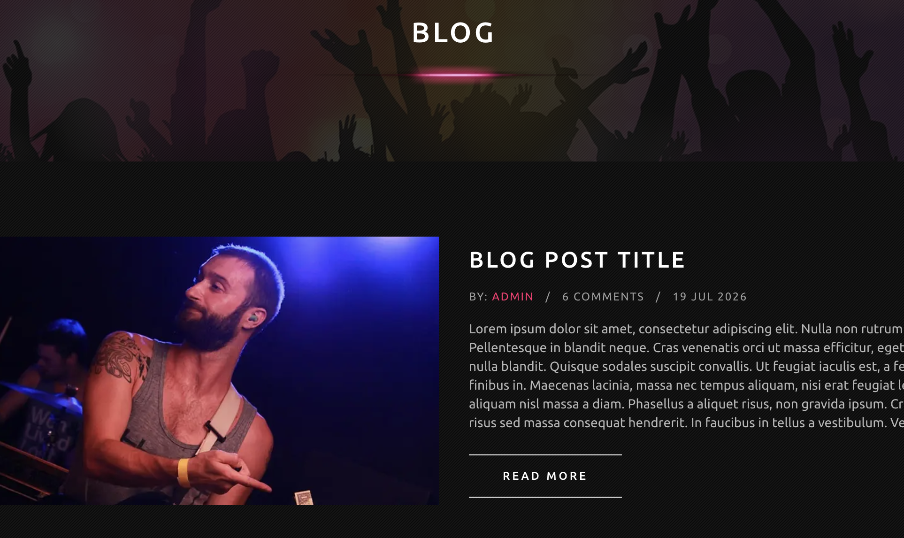
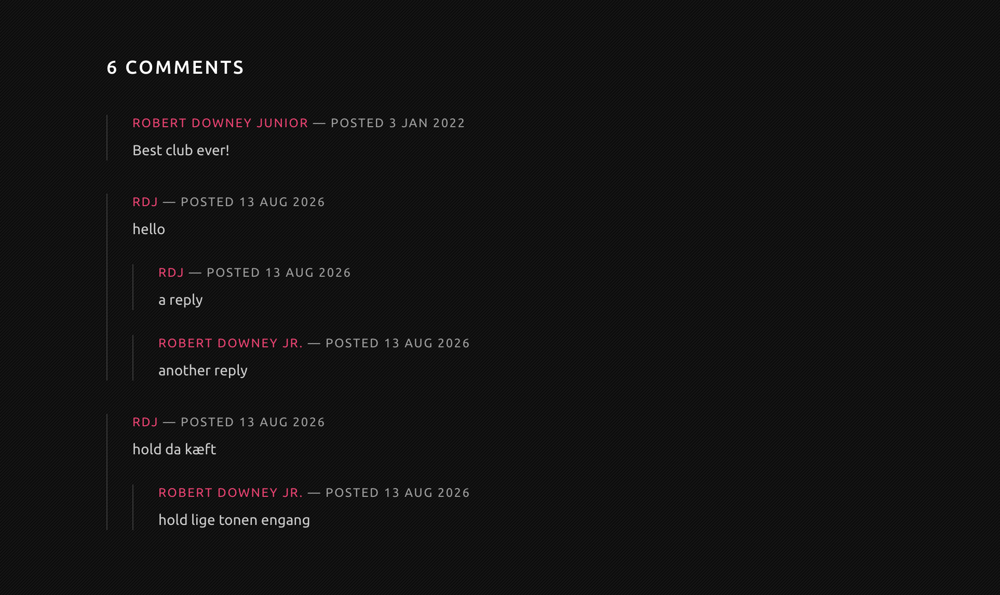
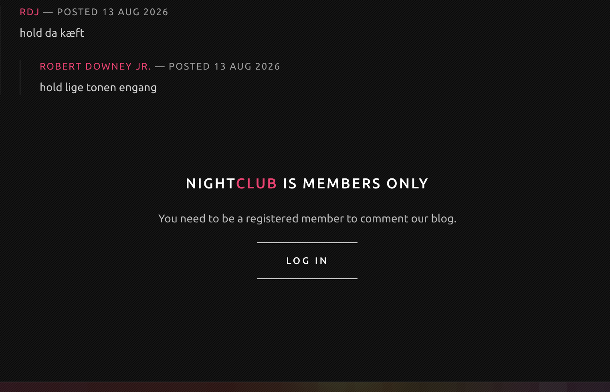

### Not built

Table booking and the music player are the two optional tasks I did not pick.
`/book` exists only because the design's navigation has the item, and a link
that 404s looks broken. See `dokumentation/not-built.md`.

---

## 5. Points for assessment

### Validation in one place

All rules live in `app/lib/schemas.ts`. The forms set `noValidate` so Zod is the
only authority. Otherwise the browser would block the submit first and show its
own messages in its own language, which does not match the design.

```ts
export const registerSchema = z
  .object({
    name: z.string().trim().min(2, "Please enter your name"),
    email: z.email("Please enter a valid email address"),
    password: z.string().min(6, "Password must be at least 6 characters"),
    repeatPassword: z.string().min(1, "Please repeat your password"),
  })
  .refine((values) => values.password === values.repeatPassword, {
    message: "The two passwords do not match",
    path: ["repeatPassword"],
  });
```

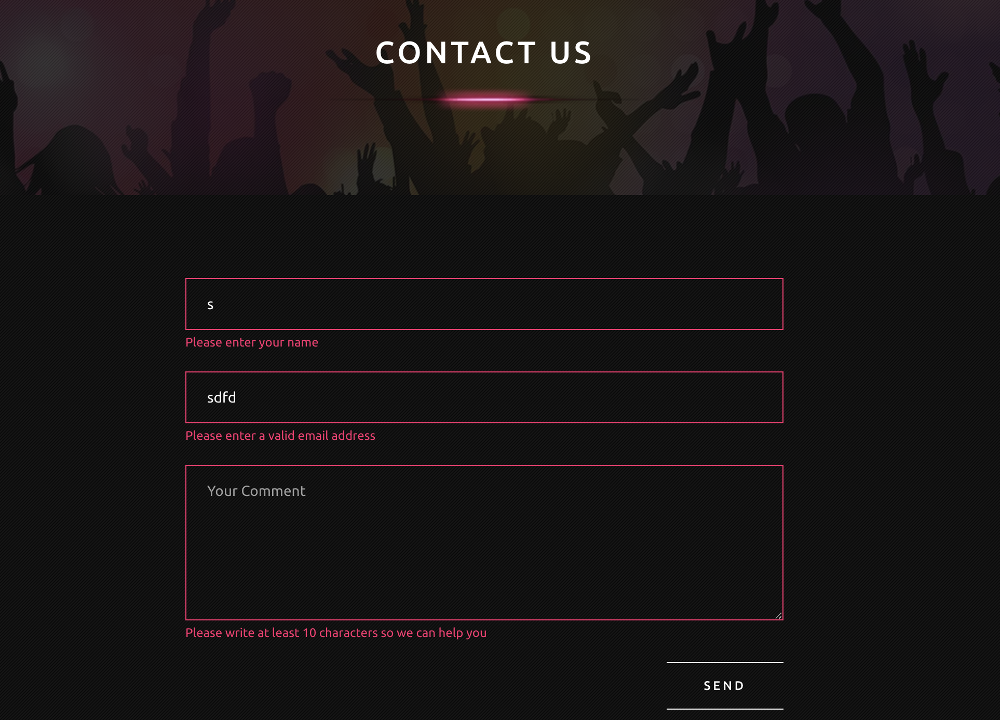
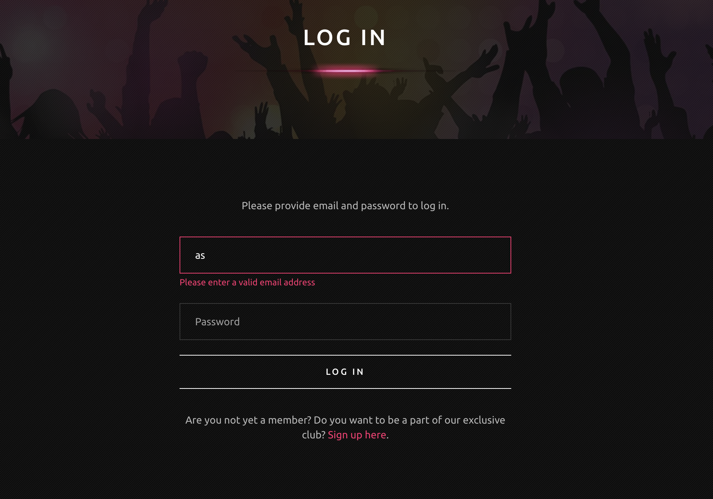
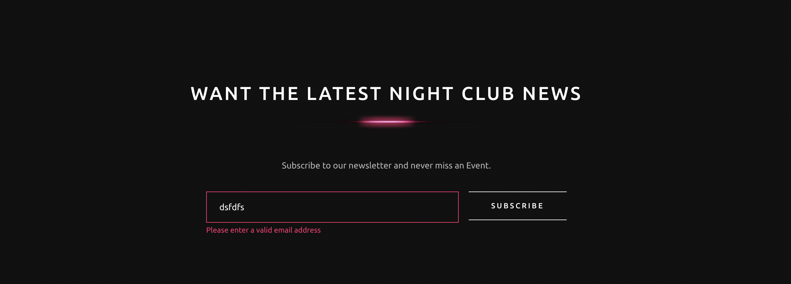

### Login and session

```
// login
take email + password from the form
validate with zod
not valid -> show errors at the fields
send to API /login
ok -> save token in an httpOnly cookie -> go to the front page
not ok -> "email or password is incorrect"
```

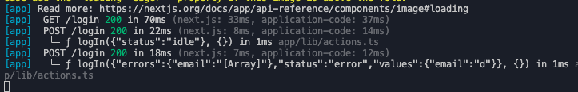

The error message is vague on purpose. The API separates `Cannot find user`
from `Incorrect password`, and passing that through would let anyone test which
email addresses exist.

The cookie is `httpOnly` and validated with a Zod schema, but it is not signed.
So hiding `/my-comments` and swapping the navigation is convenience, not
security. The real check is the API, which answers 401 without a token and 403
on someone else's comment.

### Comments and replies

The API has no idea what a reply is. json-server stores fields it does not know
about, so a reply is a comment with a `parentId`.

```
// comment
only if logged in
validate the text with zod
name and userId come from the session, not the form
a reply also sends parentId
save through the API with the token
revalidate the page so the count follows
```

Name and `userId` come from the session, so nobody can post under someone
else's name.

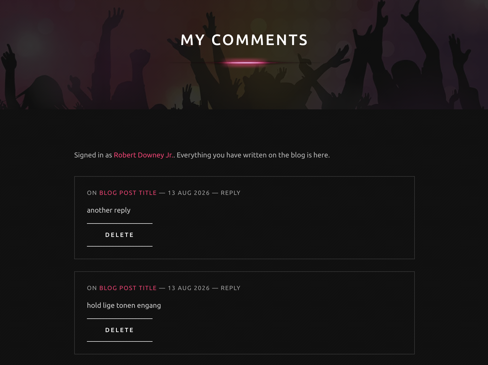

### Pagination

```
// blog list
read ?page from the url
not a positive whole number -> page 1
fetch 3 posts sorted newest first
page empty and page > 1 -> notFound()
draw the cards and the pager
```

The pager is `<Link>`, not JavaScript. Every page has its own url and the back
button works.

### Server components

Data is fetched in server components. Only what has to react to a click is
client: the carousel, the lightbox, the forms and the navigation. The carousel
gets its slides as a prop, so the API code never ends up in the browser.

### Error handling

Three layers:

1. Each section catches its own failure and shows a message, so the rest of the
   page survives.
2. `not-found.tsx` for a wrong url or a page number past the last page.
3. `error.tsx`, `(site)/error.tsx` and `global-error.tsx` for unexpected errors.

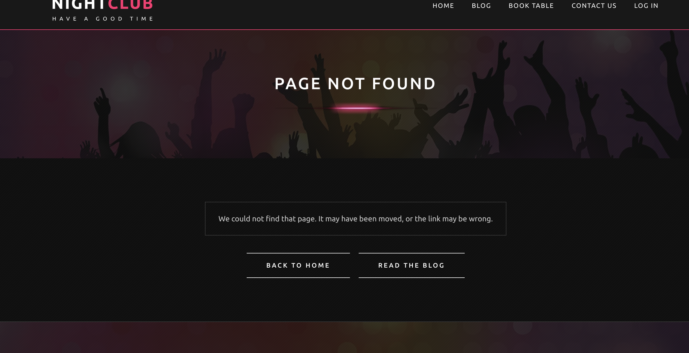

### CI

Four checks on every pull request: **Lint**, **Format**, **Build** and
**API contract**. The last one starts the API and checks the fields the app
reads. Lint and build pass happily on a broken `db.json`, this does not.

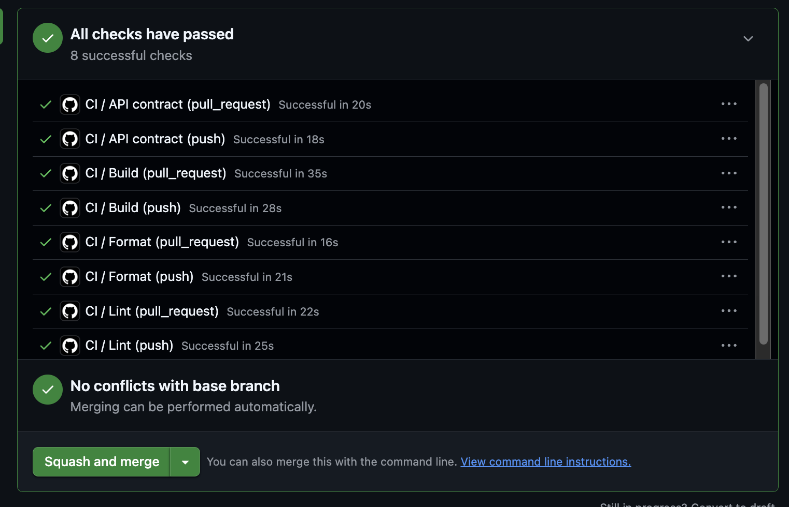

---

## 6. Self-assessment

I finished the mandatory part and both optional tasks, and I got them done
rather than leaving several things half built.

Working in small branches with one pull request per topic went well. It made it
easy to see what was done, and CI caught mistakes before they reached
`development`, among them a missing `}` in `globals.css` that broke the build.

What I would do differently: I read the design and the API as I went instead of
first. That is why I found out late that `json-server-relationship` uses `page`
and `limit` without an underscore, and that blog posts have no date field at
all. An hour spent on that up front would have made the planning better.

I did not get through the demo videos and the animations properly. That is
written down in `dokumentation/not-built.md` along with the rest.

---

## Appendices

- `dokumentation/technical-choices.md`: choices and reasoning
- `dokumentation/api-notes.md`: the API's quirks
- `dokumentation/not-built.md`: what is missing and why
